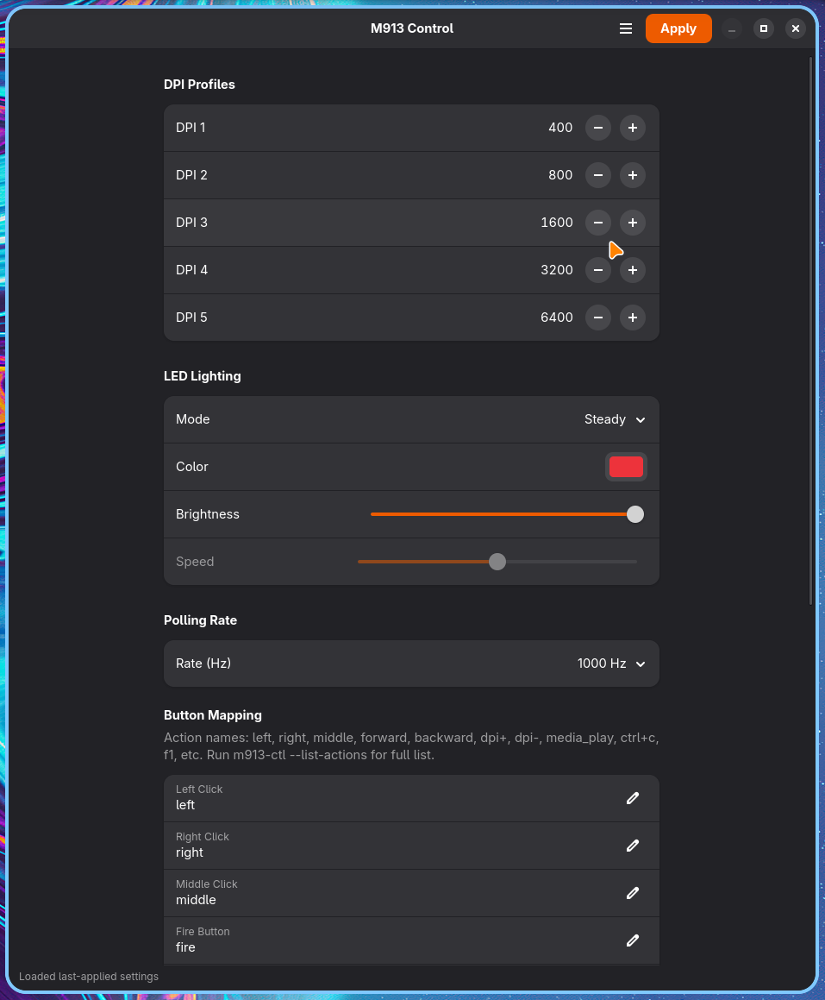

# m913-ctl-gui

GTK4/libadwaita GUI for configuring the **Redragon M913 Impact Elite** wireless mouse on Linux.

Built on top of [m913-ctl](https://github.com/Qehbr/m913-ctl), the CLI configuration tool for the M913 (USB VID `25a7`, PID `fa07`).



## Features

- **DPI profiles** — 5 slots, 100–16000 DPI
- **LED lighting** — off, steady (color + brightness), respiration (color + speed), rainbow
- **Polling rate** — 125, 250, 500, or 1000 Hz
- **Button remapping** — all 16 buttons (12 side + left/right/middle/fire), key combos, multimedia keys
- **Profile management** — save/load INI config files (fully compatible with `m913-ctl --config`)
- **Settings persistence** — remembers last-applied settings across sessions

## Requirements

- Python 3.10+
- GTK 4
- libadwaita 1.x
- [m913-ctl](https://github.com/Qehbr/m913-ctl) installed and in `$PATH`

### Installing dependencies

**Fedora:**
```bash
sudo dnf install gtk4 libadwaita python3-gobject
```

**Arch:**
```bash
sudo pacman -S gtk4 libadwaita python-gobject
```

**Debian/Ubuntu:**
```bash
sudo apt install libgtk-4-dev libadwaita-1-dev python3-gi gir1.2-gtk-4.0 gir1.2-adw-1
```

## Installation

1. Install [m913-ctl](https://github.com/Qehbr/m913-ctl) first (follow its README).

2. Clone this repo:
   ```bash
   git clone https://github.com/brunofin/m913-ctl-gui.git
   cd m913-ctl-gui
   ```

3. Run:
   ```bash
   python3 run.py
   ```

## Usage

Launch the GUI, adjust settings, and click **Apply**. Settings are sent to the mouse via `m913-ctl` and saved to `~/.config/m913-gui/last.ini`.

### Config file compatibility

Config files are plain INI and fully compatible with the CLI:

```bash
# Apply a GUI-saved profile from the command line
m913-ctl --config ~/.config/m913-gui/last.ini

# Load a CLI-created profile into the GUI
# Menu → Load Profile → select .ini file
```

This makes it easy to use the GUI for interactive configuration and the CLI for scripting, automation, or per-app profile switching.

## Acknowledgments

- [m913-ctl](https://github.com/Qehbr/m913-ctl) by Qehbr — the CLI tool and reverse-engineered protocol this GUI wraps
- [mouse_m908](https://github.com/dokutan/mouse_m908) by dokutan — original Redragon protocol research

## License

GPL-3.0
